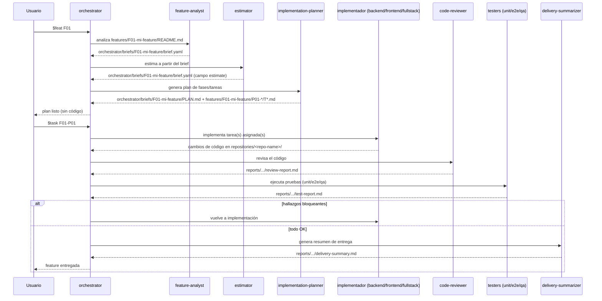

# Diagrama: interacciones entre agentes

```mermaid
sequenceDiagram
    participant U as Usuario
    participant O as orchestrator
    participant FA as feature-analyst
    participant ES as estimator
    participant IP as implementation-planner
    participant IM as implementador (backend/frontend/fullstack)
    participant CR as code-reviewer
    participant T as testers (unit/e2e/qa)
    participant DS as delivery-summarizer

    U->>O: $feat F01
    O->>FA: analiza features/F01-mi-feature/README.md
    FA-->>O: orchestrator/briefs/F01-mi-feature/brief.yaml
    O->>ES: estima a partir del brief
    ES-->>O: orchestrator/briefs/F01-mi-feature/brief.yaml (campo estimate)
    O->>IP: genera plan de fases/tareas
    IP-->>O: orchestrator/briefs/F01-mi-feature/PLAN.md + features/F01-mi-feature/P01-*/T*.md
    O-->>U: plan listo (sin código)

    U->>O: $task F01-P01
    O->>IM: implementa tarea(s) asignada(s)
    IM-->>O: cambios de código en repositories/<repo-name>/
    O->>CR: revisa el código
    CR-->>O: reports/.../review-report.md
    O->>T: ejecuta pruebas (unit/e2e/qa)
    T-->>O: reports/.../test-report.md
    alt hallazgos bloqueantes
        O->>IM: vuelve a implementación
    else todo OK
        O->>DS: genera resumen de entrega
        DS-->>O: reports/.../delivery-summary.md
        O-->>U: feature entregada
    end
```

Ver `agents/*.md` para el contrato completo de cada participante y `skills/agent-routing/SKILL.md` para cómo se decide a quién despachar en cada paso.
