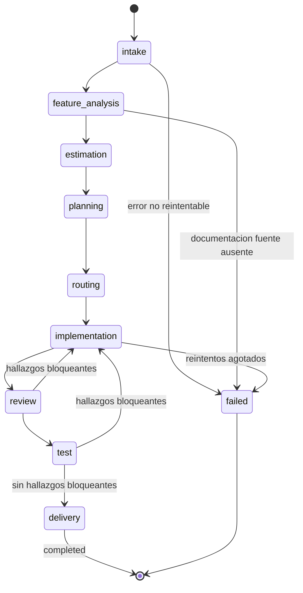

# Diagrama: flujo de ejecución (fases del workflow)

Cada nodo puede estar, en cualquier momento, en uno de: `pending`, `running`, `waiting`, `failed`, `cancelled`, `completed` (ver `docs/workflow-engine.md`). Este diagrama muestra únicamente las transiciones de **fase a fase** en el camino feliz y los principales caminos de fallo/retrabajo.
