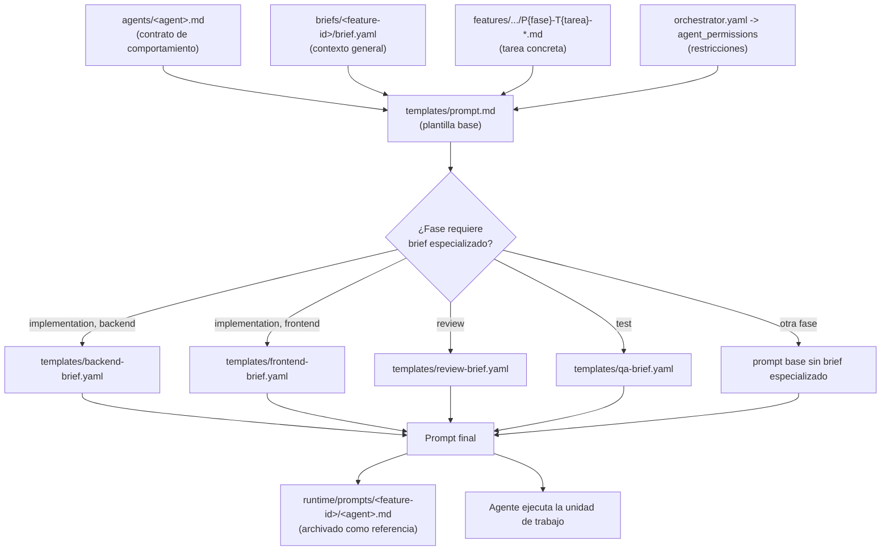

# Diagrama: construcción de prompts

```mermaid
flowchart TD
    A["agents/&lt;agent&gt;.md<br/>(contrato de comportamiento)"] --> P["templates/prompt.md<br/>(plantilla base)"]
    B["briefs/&lt;feature-id&gt;/brief.yaml<br/>(contexto general)"] --> P
    C["features/.../P{fase}-T{tarea}-*.md<br/>(tarea concreta)"] --> P
    D["orchestrator.yaml -&gt; agent_permissions<br/>(restricciones)"] --> P

    P --> E{"¿Fase requiere<br/>brief especializado?"}
    E -->|implementation, backend| F["templates/backend-brief.yaml"]
    E -->|implementation, frontend| G["templates/frontend-brief.yaml"]
    E -->|review| H["templates/review-brief.yaml"]
    E -->|test| I["templates/qa-brief.yaml"]
    E -->|otra fase| J["prompt base sin brief especializado"]

    F --> K["Prompt final"]
    G --> K
    H --> K
    I --> K
    J --> K

    K --> L["runtime/prompts/&lt;feature-id&gt;/&lt;agent&gt;.md<br/>(archivado como referencia)"]
    K --> M["Agente ejecuta la unidad de trabajo"]
```

Ver `docs/prompt-builder.md` para la descripción textual completa de cada sección del prompt.
